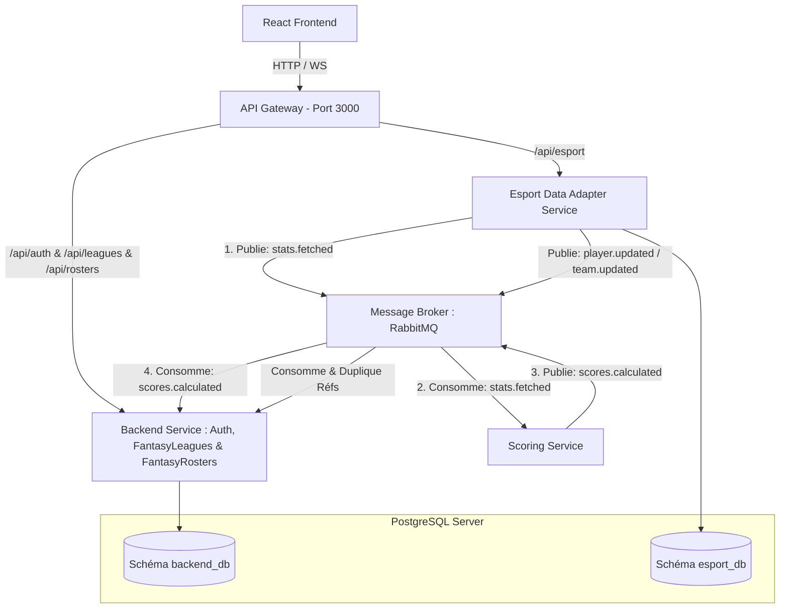

# Spécifications d'Architecture Cible : Microservices Événementiels

Ce document détaille l'architecture microservices cible pour la plateforme **Esport Fantasy League**. Conçu pour un déploiement robuste et évolutif, ce design démontre une capacité à structurer un projet complexe prêt à accueillir le travail de plusieurs développeurs en parallèle.

---

## 🗺️ Vision Globale de l'Architecture

L'architecture est entièrement orientée événements (Event-Driven Architecture) et s'appuie sur un **API Gateway** central, trois microservices métier et un bus de messages **RabbitMQ**.



---

## 🎛️ 1. API Gateway

L'**API Gateway** est le point de contact unique pour le Frontend (React).

- **Port & Exposition** : Il écoute sur le port **3000** (le port d'origine du backend NestJS). Cela évite toute modification de configuration du côté du Frontend, car l'API Gateway intercepte directement les appels.
- **Routage** :
  - `/api/auth/*` ➔ Redirigé vers le **Backend Service** (Auth intégrée).
  - `/api/leagues/*`, `/api/rosters/*` ➔ Redirigés vers le **Backend Service**.
  - `/api/esport/*` ➔ Redirigé vers l'**Esport Data Adapter Service** (pour afficher les joueurs, équipes, matchs).
- **Gestion des Tokens (JWT)** : Le Gateway valide la signature du token JWT à l'entrée. S'il est valide, il extrait le payload (ex: `userId`, `role`) et l'injecte dans les en-têtes HTTP (ex: `X-User-Id`, `X-User-Role`) transmis aux services sous-jacents.

---

## 🧱 2. Découpage et Responsabilités des Services

### A. Backend Service (Auth, Ligues & Gameplay)

- **Rôle** : Gérer les utilisateurs, les ligues de fantasy, le système de sélection de roster par les joueurs (le "Draft" fantasy) et la création/validation des rosters.
  - _Note sur le terme "Draft"_ : Le "Draft" désigne ici uniquement le choix fait par un utilisateur de l'application de sélectionner des joueurs pro réels pour composer son équipe virtuelle (`FantasyRoster`) avant le début des matchs. Il ne s'agit pas de la phase de sélection/bannissement de cartes ou de champions dans les matchs esport réels.
- **Auth intégrée** : Il contient les modules d'inscription, de connexion et d'authentification par fournisseur (Google OAuth).
- **Ingestion d'événements** : Il écoute les événements de calcul de score pour mettre à jour le classement des ligues.
- **Base de données (Schéma `backend_db`)** :
  - `User`
  - `UserRefreshToken` : Table stockant les jetons de rafraîchissement à longue durée de vie (ex: 7 jours) associés aux sessions utilisateur. Elle permet au frontend d'obtenir un nouvel Access Token JWT (à courte durée de vie, ex: 15 minutes) de manière transparente sans forcer l'utilisateur à se reconnecter, tout en permettant au backend de révoquer immédiatement une session si nécessaire.
  - `FantasyLeague`, `FantasyLeagueMember`
  - `FantasyRoster`, `FantasyRosterPick`
  - `UserActionAuditLog`
  - _Copie locale en lecture seule de :_ `EsportPlayer` et `EsportTeam` (via `esport_players_cache`).

### B. Esport Data Adapter Service

- **Rôle** : Point d'intégration avec l'API Pandascore et les API spécialisées de chaque éditeur (ex: Riot Games API, Steam Web API). Il centralise et abstrait la complexité de récupération des données et expose les entités esport de référence de manière uniforme.
- **Pattern Adapter / Strategy** :
  - Ce service implémente une interface commune pour l'ingestion.
  - Chaque jeu (**League of Legends**, **Counter-Strike**, **Valorant**, **Rocket League**) possède sa propre classe `Adapter` dédiée pour formater les données de match et de performances brutes de manière uniforme.
- **Stratégie d'Ingestion Hybride (Pandascore + API Spécifiques)** :
  - Pour aggréger la liste des matchs de tous les jeux, le service interroge Pandascore (qui a une couverture multi-jeux unifiée très propre).
  - Pour obtenir les statistiques précises nécessaires au calcul des points de chaque jeu, il interroge ensuite les API dédiées de chaque jeu (ex: l'API Riot pour récupérer les KDA détaillés de League of Legends).
  - _Pourquoi un seul service ?_ Garder ces deux étapes dans le même service permet de faire facilement la correspondance (mapping) entre l'ID d'un match Pandascore et l'ID de ce même match dans l'API spécifique du jeu, tout en évitant d'exposer ou de synchroniser ces clés techniques complexes à l'extérieur.
- **Base de données (Schéma `esport_db`)** :
  - `EsportTeam`
  - `EsportPlayer`
  - `EsportMatchDay` (représente une journée ou une période calendaire de matchs réels, par exemple la "Semaine 1" de la ligue LEC. Cette entité est globale et commune à toutes les ligues de fantasy).
  - `EsportMatch` (les matchs réels joués par les équipes professionnelles).
  - `EsportPlayerMatchDayPerformance` (cette table relie un joueur professionnel `EsportPlayer` à sa performance brute sous forme de statistiques JSON lors d'un match ou d'une journée de match spécifique).

### C. Scoring Service

- **Rôle** : Calculateur haute performance dédié aux scores de fantasy. C'est le service qui évolue le plus souvent en fonction des règles d'équilibrage des points pour chaque jeu.
- **Fonctionnement** :
  - Il est entièrement asynchrone et n'a pas d'API REST publique exposée sur le Gateway.
  - Il écoute RabbitMQ pour savoir quand de nouvelles statistiques de match sont prêtes.
  - Il applique les formules de scoring spécifiques à chaque jeu sur les statistiques brutes et publie le résultat.
- **Base de données** : Ce service est **stateless** (sans état persistant propre). Ses formules de calcul sont codées sous forme de stratégies de configuration dans le code pour faciliter les mises à jour rapides sans migrations DB.

---

## 🗄️ 3. Découpage et Partitionnement de la Base de Données

Bien que les microservices partagent la même instance physique de PostgreSQL (pour optimiser les ressources de déploiement d'un développeur solo), **les bases de données sont logiquement isolées par schéma**.

```none
PostgreSQL Instance
├── Schema: backend_db (Propriété exclusive de Backend Service)
│   ├── users
│   ├── user_refresh_tokens
│   ├── fantasy_leagues
│   ├── fantasy_league_members
│   ├── fantasy_rosters
│   ├── fantasy_roster_picks
│   ├── user_action_audit_logs
│   └── esport_players_cache (Table miroir en lecture seule)
│
└── Schema: esport_db (Propriété exclusive de Esport Data Adapter)
    ├── esport_teams
    ├── esport_players
    ├── esport_match_days
    ├── esport_matches
    └── esport_player_match_day_performances
```

### 🔄 Stratégie de Synchronisation (Eventual Consistency)

Puisque le **Backend Service** gère les drafts et la sélection des joueurs dans les rosters, il a besoin d'accéder aux données des `EsportPlayer` et des `EsportTeam`. Deux approches sont possibles, nous choisissons la seconde pour des raisons de performance et de résilience :

- **Réplication par Événements (Recommandé)** :
  - Lorsque le service **Esport** ajoute ou met à jour un joueur pro, il publie un événement `esport.player.upserted` sur RabbitMQ.
  - Le **Backend Service** consomme cet événement et met à jour sa table miroir locale `esport_players_cache` (contenant uniquement les colonnes nécessaires au draft : `id`, `name`, `role`, `esportTeamId`, `game`).
  - _Avantage_ : Le backend des ligues peut faire des jointures SQL locales rapides entre ses `fantasy_roster_picks` et ses joueurs sans faire d'appels API synchrones vers le service Esport.

---

## ✉️ 4. Flux Événementiel & Contrats de Messages (RabbitMQ)

Le bus de messages RabbitMQ utilise un Exchange de type `topic` nommé `esfl.topic`.

### Flux de Calcul de Fin de Match

```none
[Esport Data Adapter]
       │
       ▼ (Événement : esport.performance.ingested)
       Payload: { esportMatchDayId: "md_123", game: "LEAGUE_OF_LEGENDS", stats: [...] }
       │
  [RabbitMQ Exchange: esfl.topic]
       │
       ▼ (Queue: scoring-service-queue)
  [Scoring Service]
       │ (Calcul les points des joueurs pros)
       ▼ (Événement : scoring.points.calculated)
       Payload: { esportMatchDayId: "md_123", points: [{ esportPlayerId: "player_abc", score: 18.5 }, ...] }
       │
   [RabbitMQ Exchange: esfl.topic]
       │
       ▼ (Queue: backend-service-scoring-queue)
  [Backend Service]
       │ (Met à jour les scores des rosters et les classements des membres)
       ▼
[Mise à jour DB & notification client]
```

### Contrats des Messages clés (Payloads JSON)

1. **`esport.player.upserted`** :

   ```json
   {
     "id": "player_cuid_123",
     "name": "Caps",
     "esportTeamId": "team_fnatic",
     "game": "LEAGUE_OF_LEGENDS",
     "role": "MID",
     "imageUrl": "https://...",
     "isActive": true
   }
   ```

2. **`esport.performance.ingested`** :

   ```json
   {
     "esportMatchDayId": "matchday_cuid_456",
     "esportPlayerId": "player_cuid_123",
     "rawStats": {
       "kills": 8,
       "deaths": 2,
       "assists": 12,
       "creepScore": 312
     }
   }
   ```

3. **`scoring.points.calculated`** :

   ```json
   {
     "esportMatchDayId": "matchday_cuid_456",
     "performances": [
       { "esportPlayerId": "player_cuid_123", "score": 24.5 },
       { "esportPlayerId": "player_cuid_999", "score": 12.0 }
     ]
   }
   ```

---

## 🛠️ Stack Technique Cible

- **API Gateway** : NestJS avec `@nestjs/http-proxy` ou **Traefik** (configuré via Docker Label).
- **Microservices** : NestJS (Framework TypeScript).
- **Base de données** : PostgreSQL, requêté par **Prisma ORM** dans chaque service avec des fichiers `schema.prisma` distincts.
- **Communication Asynchrone** : RabbitMQ (Image officielle Docker).
- **DevOps (Local)** : Un unique fichier `docker-compose.yml` à la racine lançant :
  - PostgreSQL (avec scripts d'initialisation des multiples bases/schémas)
  - RabbitMQ
  - API Gateway
  - Backend Service
  - Esport Service
  - Scoring Service
